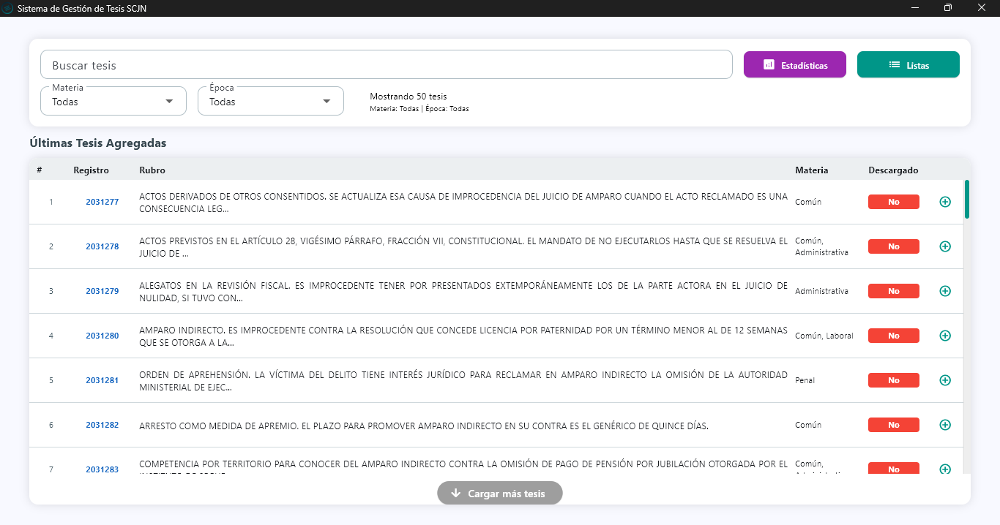
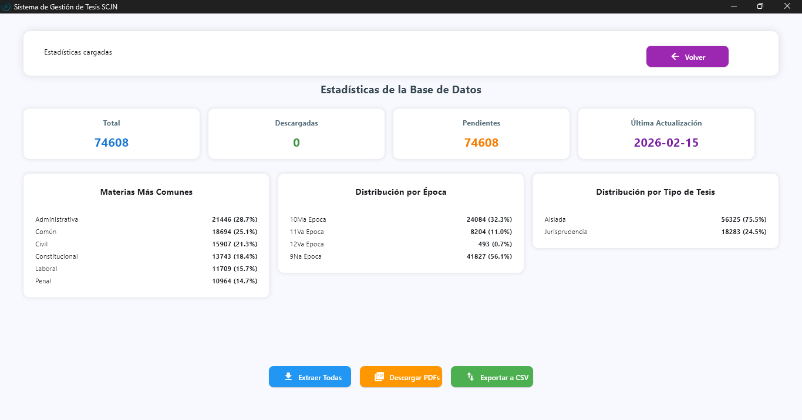
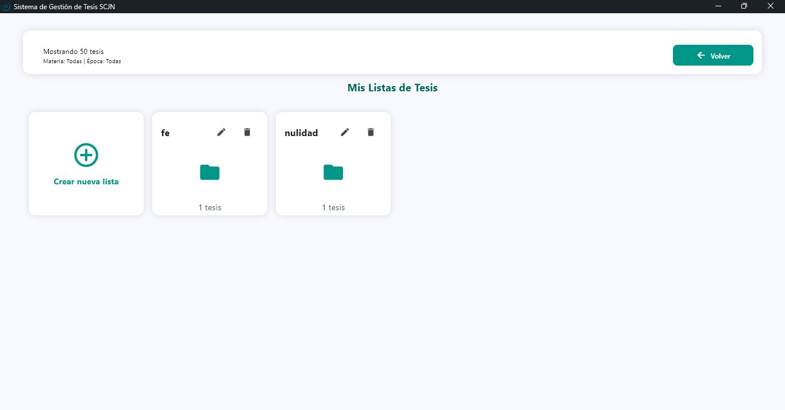
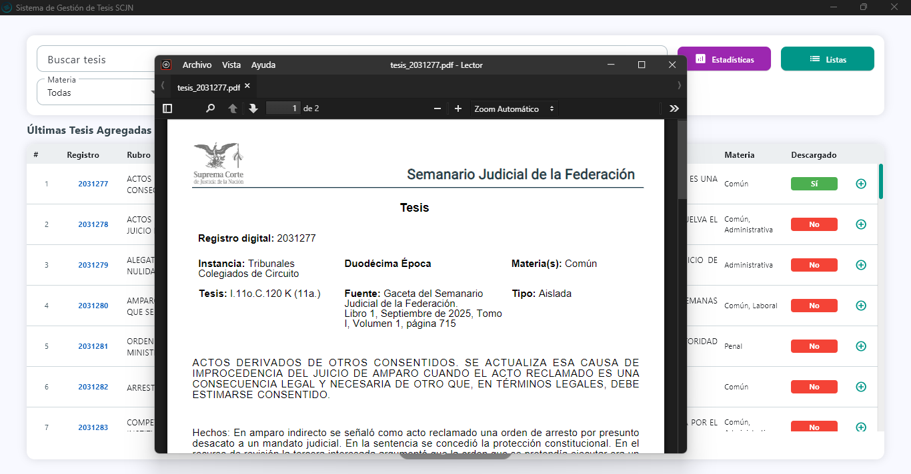

  

<h1 align="center">Gestor de Tesis SCJN</h1>

  Aplicación de escritorio para la gestión, extracción y descarga de tesis de la Suprema Corte de Justicia de la Nación (SCJN). Permite buscar, filtrar, agrupar en listas personalizadas y descargar en PDF las tesis del Semanario Judicial de la Federación.

  
   
  <em>Vista principal de la aplicación</em>

---

## Características principales

- **Extracción automática** de tesis desde el API pública de la SCJN (épocas 9ª a 12ª, Jurisprudencias y Tesis Aisladas).
- **Almacenamiento local** en base de datos haciendo uso de SQLite con soporte para búsqueda de texto completo (FTS5).
- **Búsqueda avanzada** por rubro, registro de tesis, materia y época.
- **Descarga de tesis en formato PDF** con un solo clic en el numero de registro.
- **Gestión de listas personalizadas** para agrupar tesis de interés.
- **Estadísticas** en tiempo real sobre el contenido de la base de datos y la cantidad de tesis descargadas.
- **Exportación a CSV y Excel** de los datos de las tesis y resúmenes.
- Interfaz moderna y responsiva construida con **Flet**.

---

## Capturas de pantalla

### Vista principal (tabla de tesis)

  
_Listado paginado con filtros por materia y época._

### Vista de estadísticas

  
_Resumen global y distribución por materia, época y tipo de tesis._

### Gestión de listas

  
_Creación y administración de listas de tesis favoritas._

### Descarga de PDF

  
_Visualización del PDF descargado directamente desde la aplicación._

---

## API de la SCJN

Esta aplicación consume los servicios web públicos del **Sistema SJF 2.0** de la SCJN

> **Nota:** La información obtenida es propiedad de la Suprema Corte de Justicia de la Nación. El uso de esta aplicación es meramente informativo y no sustituye la consulta oficial.

---

## Tecnologías utilizadas

| Tecnología                                    | Versión    | Propósito                    |
| --------------------------------------------- | ---------- | ---------------------------- |
| [Python](https://www.python.org/)             | 3.8+       | Lenguaje base                |
| [Flet](https://flet.dev/)                     | 0.80.5     | Interfaz de usuario          |
| [Pandas](https://pandas.pydata.org/)          | 3.0.0      | Exportación a CSV/Excel      |
| [Requests](https://docs.python-requests.org/) | 2.32.5     | Consumo de la API            |
| [OpenPyXL](https://openpyxl.readthedocs.io/)  | 3.1.5      | Generación de archivos Excel |
| [SQLite3](https://www.sqlite.org/)            | (incluido) | Base de datos local          |
| [PyInstaller](https://pyinstaller.org/)       | (opcional) | Empaquetado del ejecutable   |

---

## Instalación y ejecución

### Desde el código fuente

1. Clona el repositorio o descarga los archivos.
2. Crea un entorno virtual (recomendado):
   python -m venv venv
   source venv/bin/activate # Linux/Mac
   venv\Scripts\activate # Windows
3. Instala las dependencias:
   pip install flet==0.80.5 pandas==3.0.0 requests==2.32.5 openpyxl==3.1.5
4. Ejecuta la aplicación:
   python Extractor_Tesis_SCJN.py

### Ejecutable precompilado (one‑file)

Puedes descargar la última versión del ejecutable desde la sección **Releases** del repositorio:

1. Ve a [Releases](https://github.com/deadjoker514/Gestor_Tesis_SCJN/releases/tag/v1.0.0) y descarga el archivo `GestorTesisSCJN.exe`.
2. Coloca el ejecutable en una carpeta vacía.
3. Ejecuta el archivo. En el primer inicio se creará automáticamente la carpeta `data` y se copiará la base de datos inicial.
4. La carpeta `tesis_descargadas` se generará para almacenar los PDF.

> **Nota:** Asegúrate de tener permisos de escritura en el directorio donde se encuentra el ejecutable. Este es un ejecutable One-File lo que significa que solamente se ejecuta, no es necesaria su instalacion, lo cual es util si decides usarla en un medio portatil como una usb.

> Compatible con Windows 10 y 11

---

## Cómo usar la aplicación

### Barra superior

- **Campo de búsqueda**: permite buscar por registro (IUS), rubro o clave de tesis. La búsqueda es automática mientras escribes.
- **Botón "Estadísticas"**: cambia a la vista de resúmenes.
- **Botón "Listas"**: accede a la gestión de listas personalizadas.

### Filtros

- **Materia**: selecciona una materia específica o "Todas".
- **Época**: elige entre las épocas disponibles o "Todas".

### Vista de tabla

- Muestra las tesis en paginación infinita (carga más al hacer clic en "Cargar más tesis").
- Cada fila contiene:
  - Número consecutivo.
  - **Registro (IUS)** – clic para abrir/descargar el PDF.
  - **Rubro** – Titulo de la tesis jurisprudencial o tesis aislada.
  - **Materia(s)** – Tipo de materias de las tesis.
  - **Estado de descarga** – "Sí" (verde) / "No" (rojo).
  - **Botón +** – Para agregar las tesis a una lista nueva o existente.

### Vista de estadísticas

- Muestra tarjetas con totales, tesis descargadas, pendientes y última actualización.
- Gráficos de distribución por época, tipo de tesis y materias más comunes.
- Botones para **Extraer Todas** (inicia la descarga masiva de metadatos de las tesis desde la API, recomendable para actualizar los mismos cada que salen nuevas tesis) y **Descargar PDFs** (descarga todas las tesis pendientes).
- También se puede exportar a CSV/Excel.

### Gestión de listas

- Desde el botón "Listas" se accede al panel de listas.
- **Crear nueva lista**: botón con icono `+`.
- Cada lista muestra su nombre, número de tesis y botones para renombrar o eliminar.
- Al hacer clic en una lista se ven las tesis que contiene, con opción de quitarlas.

### Exportación

- Desde la vista de estadísticas, el botón "Exportar a CSV" genera un archivo CSV con todas las tesis y otro Excel con los resúmenes.

---

## Créditos y licencia

**Desarrollador:** Licenciado en Derecho Enrique Hernández Roque  
**Contacto:** [Enlace a mi Portafolio](https://deadjoker514.github.io/Portafolio/)

Tambien mediante 

Todas las dudas y comentarios se reciben con gusto.

La información mostrada sobre tesis es propiedad de la **Suprema Corte de Justicia de la Nación**.  
Esta aplicación es de **código abierto** y se distribuye bajo la licencia **MIT**. Consulta el archivo [LICENSE](LICENSE) para más detalles.

---
